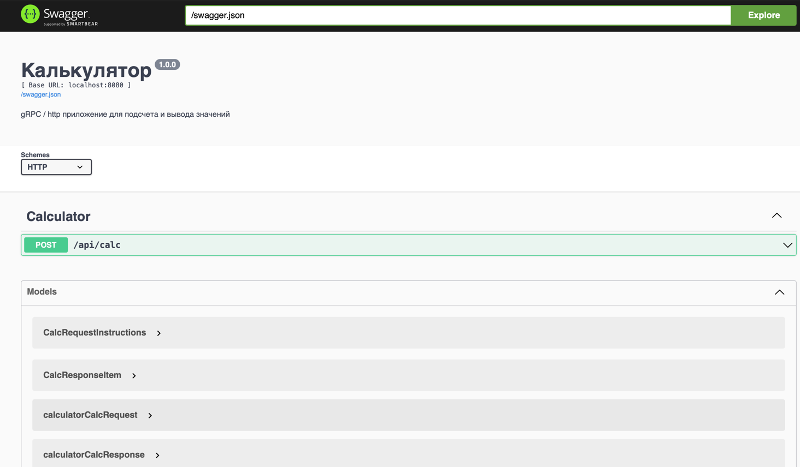
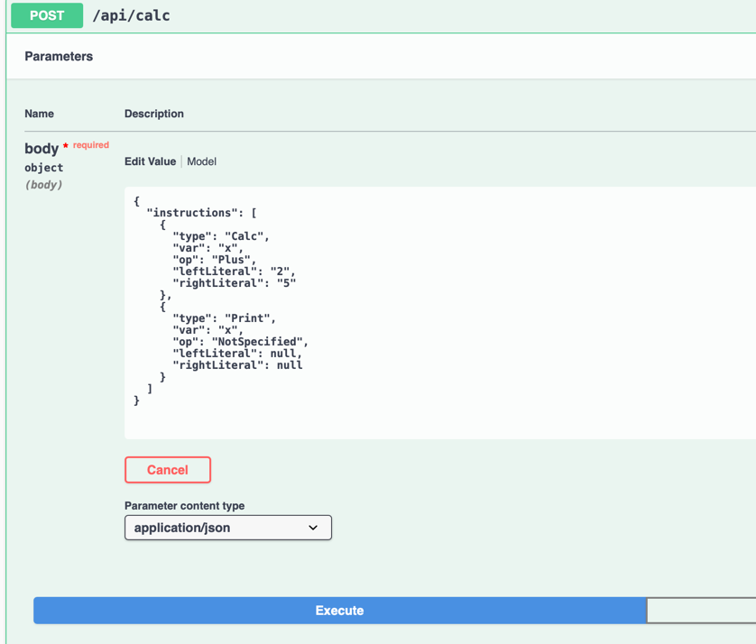
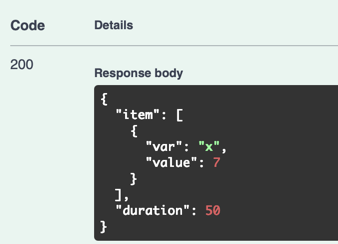
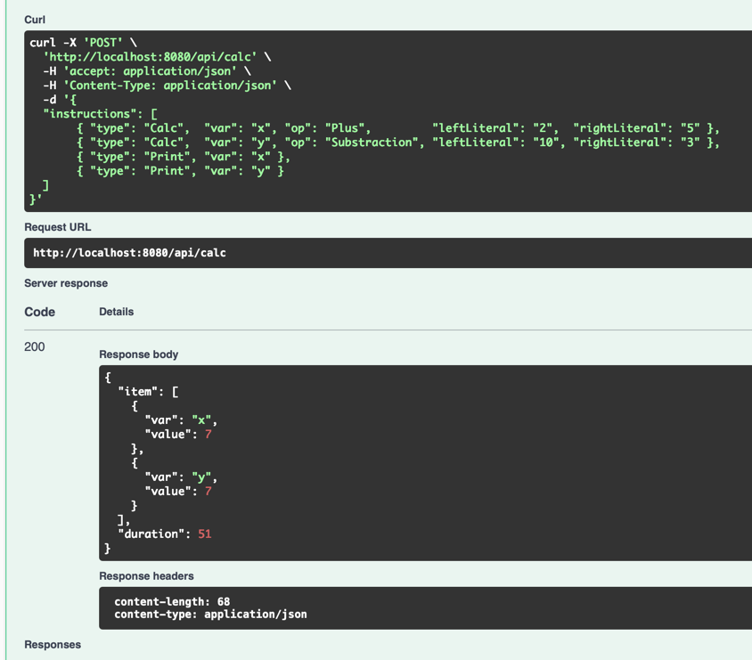
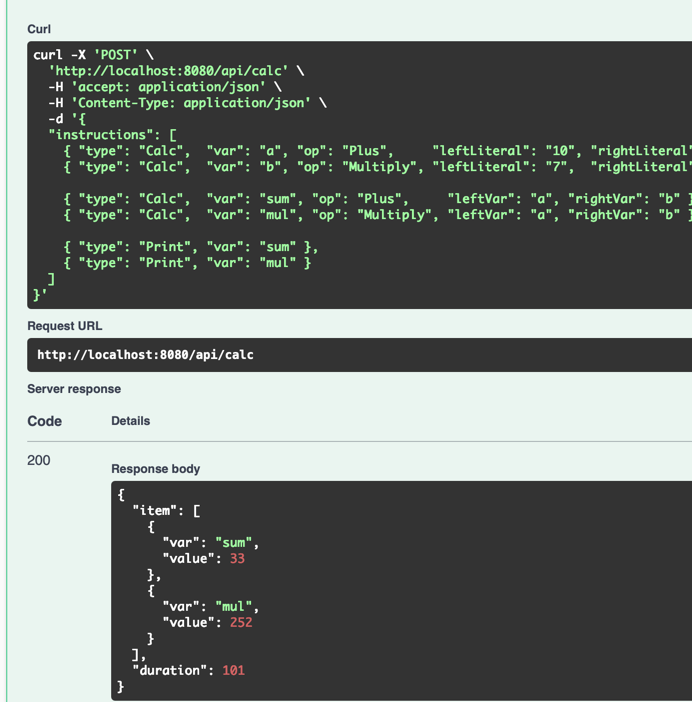
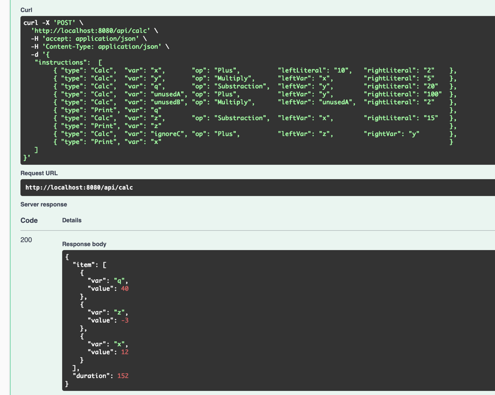

# Summary

`Industrial-backend-development-task` - Проект по курсу "Промышленная бэкенд разработка"

Решается задача параллельных вычислений связанных между собой инструкций

Детальная постановка в [TASK.md](./TASK.md)

`Все важные тест-кейсы разобраны в` [*4 главе*](#примеры-использования)

---

## Оглавление
1. [Запуск](#запуск)
   1. [Контейнеризированный](#установливка-зависимостей-и-развертывание-контейнера)
   2. [Локальный](#локальный-запуск-без-докера)
2. [Описание реализации](#краткое-содержание)
3. [Особенности реализации](#особенности)
4. [Примеры использования в картинках](#примеры-использования)

---
## Запуск

### Установливка зависимостей и развертывание контейнера
```bash
make run
```
### Локальный запуск без докера
```bash
make deps
make industrial
```

### Swagger http://localhost:8081/swagger/index.html

---
## Краткое содержание
Релизовано построение графа зависимостей и воркерпул задач
Учтены неиспользуемые переменные методом обход графа в ширину

---
## Особенности
В связи с CPU-Bound спецификой задачи, нет смысла создавать больше, чем GOMAXPROCS горутин одновременно,
поэтому я добавил ограничение количества воркеров == runtime.GOMAXPROCS

---
## Примеры использования
Каждый пример подкриплен скриншотом в конце

Интерфейс сваггера


---
### Первый пример
```json
{
  "instructions": [
    {
      "type": "Calc",
      "var": "x",
      "op": "Plus",
      "leftLiteral": "2",
      "rightLiteral": "5"
    },
    {
      "type": "Print",
      "var": "x",
      "op": "NotSpecified",
      "leftLiteral": null,
      "rightLiteral": null
    }
  ]
}
```

### Результат
```json
{
  "item": [
    {
      "var": "x",
      "value": 7
    }
  ],
  "duration": 50
}
```


Получили х = 7
Время работы 50 мс = 1 операция

---
### Пример 2

```json
{
  "instructions": [
       { "type": "Calc",  "var": "x", "op": "Plus",         "leftLiteral": "2",  "rightLiteral": "5" },
       { "type": "Calc",  "var": "y", "op": "Substraction", "leftLiteral": "10", "rightLiteral": "3" },
       { "type": "Print", "var": "x" }, 
       { "type": "Print", "var": "y" }
  ]
}
```

### Результат
```json
{
  "item": [
    {
      "var": "x",
      "value": 7
    },
    {
      "var": "y",
      "value": 7
    }
  ],
  "duration": 51
}
```
Время выполнения "duration": 51 что означает корректную работу на двух


---

### Пример 3
Пример с параллельностью в два шага
```json
{
  "instructions": [
    { "type": "Calc",  "var": "a", "op": "Plus",     "leftLiteral": "10", "rightLiteral": "2" },
    { "type": "Calc",  "var": "b", "op": "Multiply", "leftLiteral": "7",  "rightLiteral": "3" },

    { "type": "Calc",  "var": "sum", "op": "Plus",     "leftVar": "a", "rightVar": "b" },
    { "type": "Calc",  "var": "mul", "op": "Multiply", "leftVar": "a", "rightVar": "b" },

    { "type": "Print", "var": "sum" },
    { "type": "Print", "var": "mul" }
  ]
}
```
### Результат
```json
{
  "item": [
    {
      "var": "sum",
      "value": 33
    },
    {
      "var": "mul",
      "value": 252
    }
  ],
  "duration": 101
}
```

---

### Пример 3 + 2
```json 
{
  "instructions": [
    { "type": "Calc", "var": "p", "op": "Substraction", "leftLiteral": "100", "rightLiteral": "1" },
    { "type": "Calc", "var": "q", "op": "Plus",         "leftLiteral": "5",   "rightLiteral": "5" },
    { "type": "Calc", "var": "r", "op": "Multiply",     "leftLiteral": "3",   "rightLiteral": "7" },

    { "type": "Calc", "var": "s", "op": "Multiply", "leftVar": "p", "rightVar": "q" },
    { "type": "Calc", "var": "t", "op": "Multiply", "leftVar": "q", "rightVar": "r" },

    { "type": "Print", "var": "s" },
    { "type": "Print", "var": "t" }
  ]
}
```
### Результат
```json
{
   "item": [
        { "var": "s", "value": 990 },
        { "var": "t", "value": 210 }
     ],
   "duration": 101
}
```
### Контрольный пример
```json
{
   "instructions":  [
        { "type": "Calc",  "var": "x",       "op": "Plus",          "leftLiteral": "10",   "rightLiteral": "2"    },
        { "type": "Calc",  "var": "y",       "op": "Multiply",      "leftVar": "x",        "rightLiteral": "5"    },
        { "type": "Calc",  "var": "q",       "op": "Substraction",  "leftVar": "y",        "rightLiteral": "20"   },
        { "type": "Calc",  "var": "unusedA", "op": "Plus",          "leftVar": "y",        "rightLiteral": "100"  },
        { "type": "Calc",  "var": "unusedB", "op": "Multiply",      "leftVar": "unusedA",  "rightLiteral": "2"    },
        { "type": "Print", "var": "q"                                                                             },
        { "type": "Calc",  "var": "z",       "op": "Substraction",  "leftVar": "x",        "rightLiteral": "15"   },
        { "type": "Print", "var": "z"                                                                             },
        { "type": "Calc",  "var": "ignoreC", "op": "Plus",          "leftVar": "z",        "rightVar": "y"        },
        { "type": "Print", "var": "x"                                                                             }
   ]
}
```
### Результат
```json
{
  "item": [
    {
      "var": "q",
      "value": 40
    },
    {
      "var": "z",
      "value": -3
    },
    {
      "var": "x",
      "value": 12
    }
  ],
  "duration": 152
}
```
---
### Невалидные кейсы
```json
{
  "instructions": [
    { "type": "Calc",  "var": "y", "op": "Plus", "leftVar": "x", "rightLiteral": "1" },
    { "type": "Print", "var": "y" }
  ]
}
```

### Результат
```json
{
  "code": 2,
  "message": "missing variable",
  "details": []
}
```

---

### Ошибочный оператор
```json
{
  "instructions": [
    { "type": "Calc",  "var": "x", "op": "NotSpecified", "leftLiteral": "1", "rightLiteral": "2" },
    { "type": "Print", "var": "x" }
  ]
}
```
### Результат
```json
{
  "code": 2,
  "message": "unknown operation",
  "details": []
}
```
---

### Пример вывода отсутствующей переменной
```json
{
  "instructions": [
    { "type": "Print", "var": "no_such_var" }
  ]
}
```
### Результат
```json
{
  "item": [],
  "duration": 0
}
```





